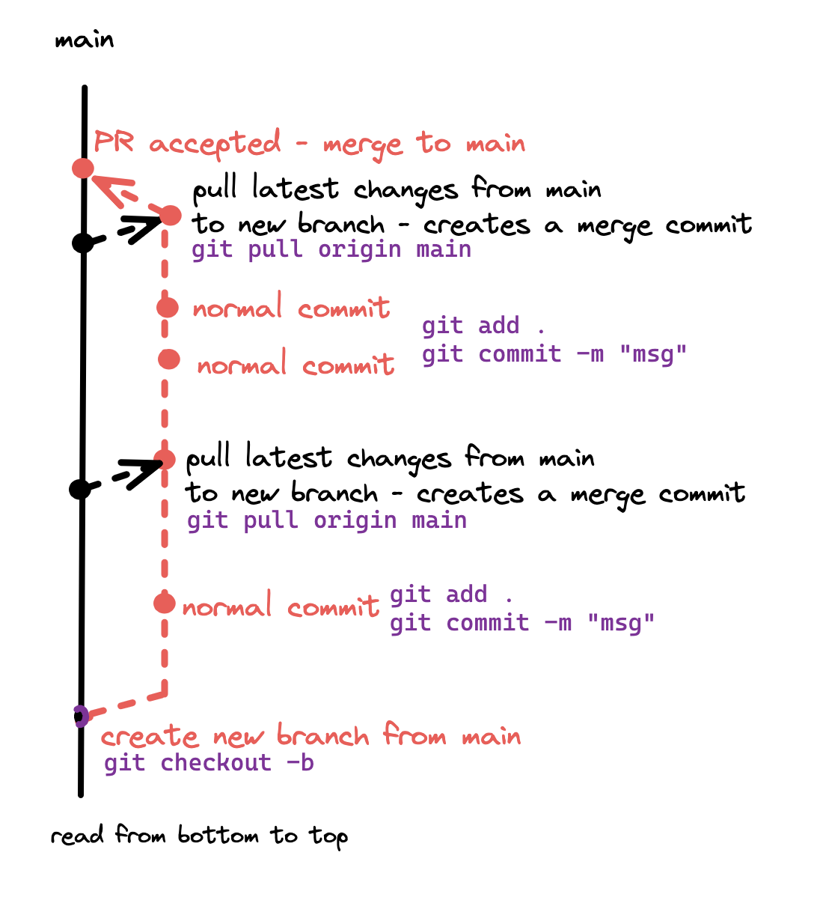

# Git Commands

## Guide on git processes:

What you'll need most: 


````git checkout main````

````git pull origin````

````git checkout -b MOIA-{number}_new_branch_name````

````git add .````

````git commit -m "write commit message between the quotation marks"````

````git push origin````

------------------


1. Start from main : 
````git checkout main````

- pull the latest changes of main if not up-to-date: ````git pull origin````

This will actually do two things: ````git fetch origin```` & ````git merge````

First it will fetch the changes but not merge it yet to your branch and the latest will merge the changes to your branch. 
git pull will directly merge changes that doesn't have any conflicts, if there is, it will show on your editor as conflicts file. 

- create new branch and checkout out the branch (it creates/ branches off a new branch out of main) : ````git checkout -b MOIA-{number}_new_branch_name````

2. Write your code

3. To commit and push:

    - *git add* will stage your changes :  ````git add .````

you can then commit your changes : ````git commit -m "write commit message between the quotation marks"````

then you can push to the remote *(origin)* : ````git push origin````

In between you can check regularly if your branch is up-to-date with main so if there's conflicts with your code it doesn't get to much to resolve: ````git pull origin main````



## Other commands: 


- To checkout branches: ````git checkout {name of branch}````

if you want to checkout the last checked out branch on the one you currently are: ````git branch checkout -````

so if you were checked on `main` then go to `new-branch` and write ````git branch checkout -```` to your terminal, it will go to main and vice versa `new-branch` then go to `main` and write ````git branch checkout -```` it will go to new-branch 

- It happened to me, many time, maybe you'd find that useful: I don't like the name of the branch I created and want to change it, then you can do that easily if you didn't push it remotely yet: 

create new branch out of the old one - and then delete the old branch if locally

````git branch -m new-branch-name```` 

````branch -D old-branch-name````