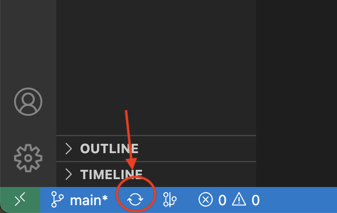
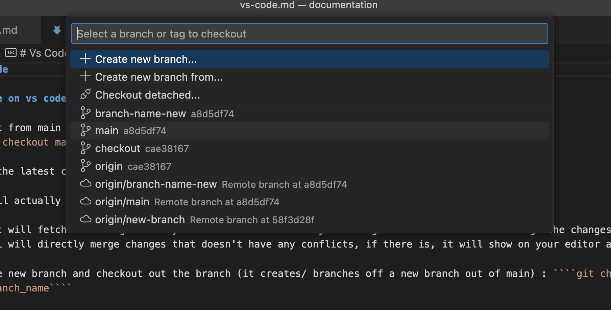
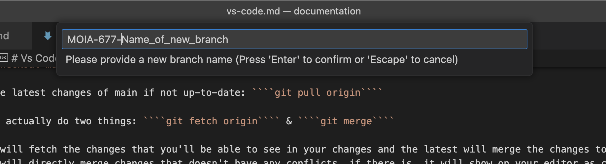
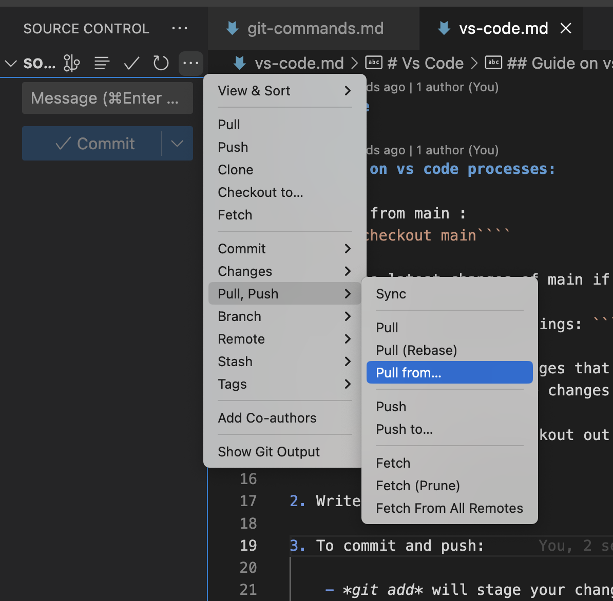
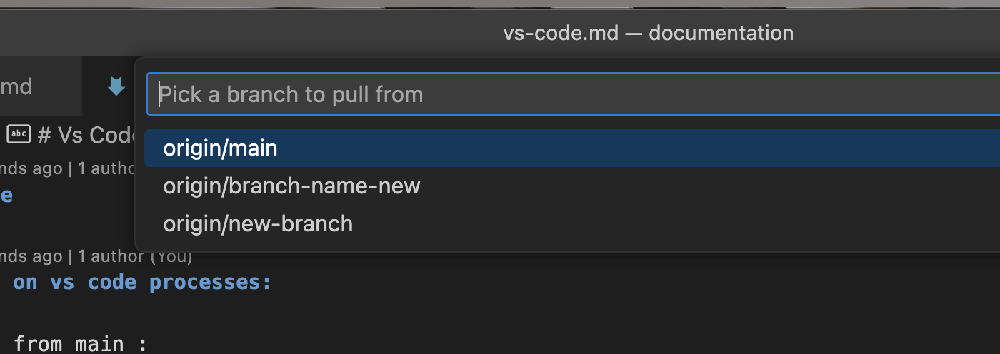

# Vs Code

## Guide on vs code processes:

1. Start from main - if something to pull click on the refresh: 

 

2. click on main and create branch from main

------------------

- pull the latest changes of main if not up-to-date: 

2. Write your code

3. To commit and push: you know how :) 